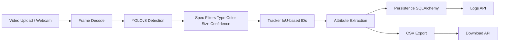

# Architecture

## Runtime Components
- API service: FastAPI endpoints for upload, status, logs, and exports.
- Processing core: detection, filtering, tracking, attribute extraction.
- Persistence: SQLAlchemy-backed track logs.
- Dashboard: Streamlit interface for uploads, progress, and results.

## Config and Environments
- Centralized settings in `backend/core/settings.py`.
- `.env.example` documents dev/prod runtime knobs.
- `APP_ENV` and `LOG_LEVEL` control runtime mode and verbosity.
